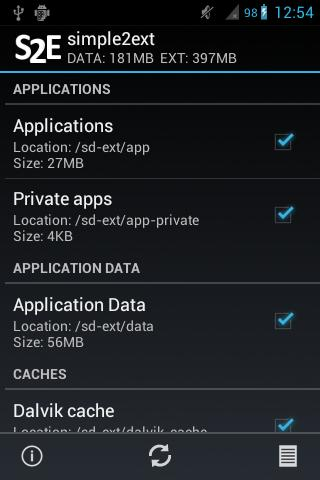

import Link from "@/components/Link.astro";

Om te beginnen een iets oudere tutorial afkomstig van m'n vorige blog, aangepast met de nodige updates.

Het betreft een tutorial voor het aanmaken van een SD-ext partitie op een micro SD kaart. Ik heb hiervoor een 8GB Adata Class 6 micro SD kaart gebruikt.

Ik heb gekozen voor ongeveer 25% voor de ext3 partitie (+/- 2GB), en 75% voor de fat32 partitie.

Een kort stappenplan zoals ik het gedaan heb (er zijn meerdere mogelijkheden):

Benodigdheden:

- Ubuntu met GParted (GNOME Partition Editor) op de PC
- HTC Legend (rooted)
- Cyanogenmod 7.x
- micro SD kaart
- S2E (simple2ext) gratis verkrijgbaar in de Google Play Store (voor meer info zie: <Link external href="https://forum.xda-developers.com/showthread.php?t=917377">XDA Developers - S2E topic</Link>)

**Belangrijk! Maak een complete backup van je ROM mocht er iets fout gaan, alles is op eigen risico! Zoals de developer van simple2ext zegt: ONLY USE AT YOUR OWN RISK! BEFORE USING MAKE A FULL BACKUP, THE APPLICATION CAN HARM YOUR DEVICE.**

- Start Ubuntu op de PC
- Verbind een SD cardreader met micro SD kaart aan je PC.
- Backup al je data van je micro SD kaart naar je PC! (Alle data wordt namelijk verwijderd van je micro SD kaart)
- Start GParted (GNOME Partition Editor).
- Selecteer de micro SD kaart in GParted.
- Verwijder alle partities op de micro SD kaart.
- Maak eerst een nieuwe Primary partitie aan van het type: fat32 (ongeveer 6GB)
- Maak dan een nieuwe Primary partitie aan van het type: ext3 (ongeveer 2GB)
- Vervolgens deze operaties uitvoeren door op het vinkje in de toolbar te klikken (ik geloof Apply Operations heette het)
- Als dit succesvol is, kopieer de backup van je data terug (opgeslagen in stap 3) naar de fat32 partitie.
- Stop de micro SD kaart weer in je HTC Legend.
- Zet de HTC Legend aan.
- Ga naar de Google Play Store en download/installeer S2E (simple2ext).
- Link: <Link external href="https://play.google.com/store/apps/details?id=ru.krikun.s2e">Google Play Store - S2E (simple2ext)</Link>
- Start s2e en de applicatie zal root rechten vragen, geef de root rechten met het "onthouden" vinkje aan.
- Als alles goed is gegaan zie je bovenin de app de grootte van de ext partitie.
- Vink hetgene aan wat je naar je sd-ext partitie wil verplaatsen. (Ik heb gekozen voor: Applications, Private apps, Dalvik cache en Download cache)
- De app zal om een reboot vragen, klik op reboot.
- De eerste reboot duurt langer (heb even geduld), omdat alle data van het interne opslaggeheugen wordt verplaatst naar de ext3 partitie op de micro SD kaart.
- Als de HTC Legend volledig is opgestart kun je ervoor kiezen om de apps die via de Google Apps2SD methode zijn verplaatst, nu weer terug te zetten naar je telefoongeheugen. Ik werkelijkheid worden de applicaties dan niet op je interne telefoongeheugen geplaatst, maar op je zojuist gemaakte ext3 partitie op de SD Kaart.
- Veel plezier! 😀

Na het toepassen van deze methode laden de apps op de micro SD kaart zelfs nog iets sneller in na een reboot in vergelijking met de standaard Google Apps2SD methode was mijn ervaring.

