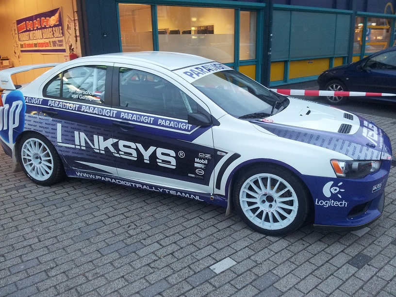
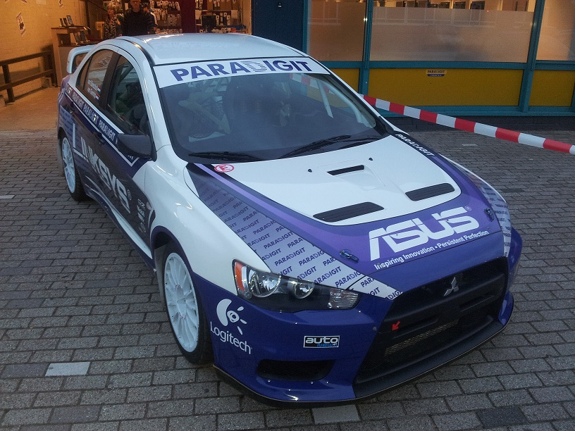
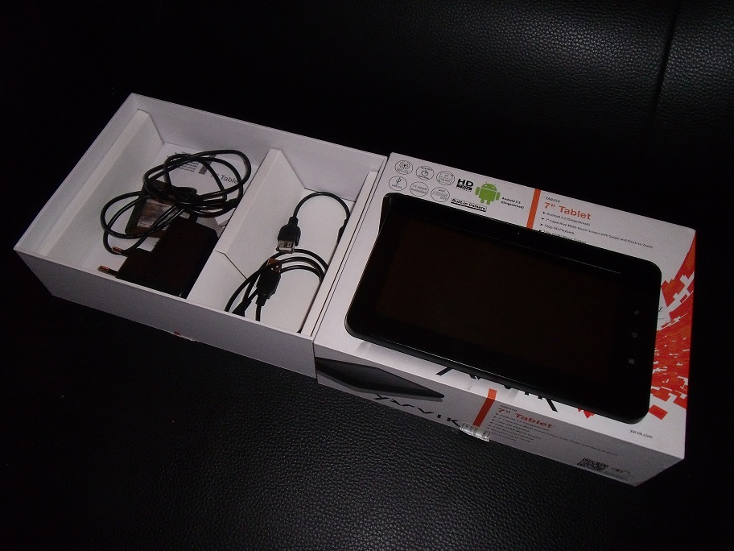
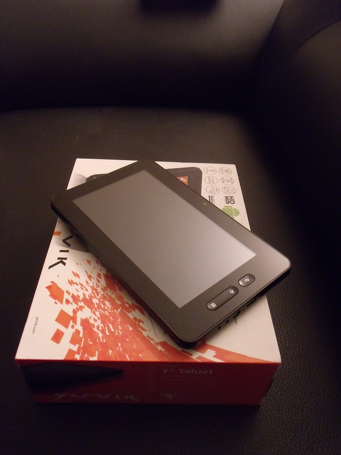

Afgelopen week ontving ik een nieuwsbrief van Paradigit in de mailbox, waar met niet te missen letters stond geschreven: 19/20 oktober GarageSale met dumpprijzen.

Zo nieuwsgierig als ik ben, was ik toch vrijdag even een kijkje gaan nemen. Bij aankomst trof ik het volgende aan...

<!--more-->

Geweldig! Op naar binnen, de garage in. Ik had me de garage groter voorgesteld dan dat hij in werkelijkheid was. Het was eigenlijk niet meer dan een toonbank met erachter een aantal stellages gevuld met notebooks en een stuk of 8 laptops die tentoongesteld waren als demo model. Na wat rondkijken viel me op dat er ook een stapeltje tablets bij de kassa lagen. Yarvik tablets. Deze tablets vallen in de categorie "Budget Tablets".

Eén van de tablets was een Yarvik TAB250, deze werd aangeboden voor een prijs van €39,-. Een hele mooie prijs, goedkoper heb ik ze nog nergens gezien.

Ondanks dat ik reeds in het bezit ben van een Transformer TF101 en Nexus 7 heb ik toch besloten deze tablet aan te schaffen, maar dan niet voor mezelf.

Thuis aangekomen begon de "Uitpakparty". 😀 De tablet verkeerde in goede staat, het scherm ziet er nog prima uit, alleen de achterkant bevat enkele krasjes, maar dat mag de pret niet drukken.

Zoals verwacht was de batterij helemaal leeg. Na een paar uurtjes opladen, de tablet aangezet. Toen viel me meteen op dat het niet om een winkel demo-model ging zoals Paradigit beweerde, maar om een terug gebrachte tablet van filiaal Paradigit Maastricht (volgens de sticker op de verpakking). Ik ontdekte namelijk dat er nog foto's op aanwezig waren, vermoedelijk afkomstig van de vorige eigenaresse, een meisje in haar tienerjaren. Ik kan er met m'n verstand niet bij dat mensen gewoon een tablet inleveren bij de winkel, zonder eerst zelf een factory reset te doen om alle persoonlijke informatie te verwijderen. Op z'n minst zou je verwachten dat de ouders hier op letten! De tablet zal maar in verkeerde handen vallen.. Ook snap ik niet goed dat Paradigit deze handeling (factory-reset) niet verricht voordat de tablet weer de verkoop in gaat.

Ook ontdekte ik dat er een mislukte poging was gedaan om de Android Market te installeren. De Android Market applicatie crashte meteen na opstarten. En "last-but-not-least", het gmail e-mailadres van vermoedelijk de vorige eigenaresse stond ook nog bij de synchronisatie-instellingen in het configuratie-scherm aangegeven een sync-error.

Omdat ik met een schone tablet wil beginnen alvorens allerlei apps te gaan installeren, heb ik zelf natuurlijk even een factory reset uitgevoerd.

Uiteindelijk is het wel gelukt om de Android Market werkend te krijgen op de Yarvik TAB250. Deze site heeft de oplossing geboden: <a href="https://www.hembrow.eu/personal/yarviktab250.html" target="_blank">Hembrow</a>

Toch gaf de Android Market nog niet alle beschikbare apps aan, ook niet na modificatie van het build.prop bestand.

Een alternatieve market applicatie installeren is eigenlijk nog de snelste weg naar succes. De 1Mobile Market functioneert prima op het apparaat.

Update 2025-12-29: URL naar 1Mobile Market verwijderd (geblokkeerd door blocklist)

Ik zal verder geen uitgebreide review van de tablet gaan schrijven, want die zijn er al.

Update 2025-12-29: URL naar hardware.info verwijderd (site is gestopt)

Mijn conclusie is: voor wie niet teveel verwacht, en niet teveel wil uitgeven is het een redelijke tablet, zeker voor de prijs van €39,-.
