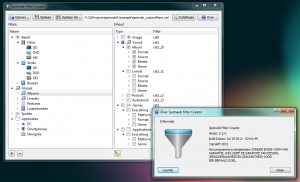

Een tijdje geleden heb ik in mijn vrije tijd een tool proberen te maken om het aanmaken van Spotweb Filter XML bestanden te vereenvoudigen.

Ik heb de wiki-pagina [hoe filters werken](https://github.com/spotweb/spotweb/wiki/Hoe-filters-werken) van [spotweb](https://github.com/spotweb/spotweb) hiervoor als uitgangspunt gebruikt.

Spotweb Filter Creator is gemaakt met behulp van de [Qt SDK](http://qt-project.org/downloads), hierdoor is het mogelijk multi-platform (Windows/Linux) versies van Spotweb Filter Creator te maken.

Meer informatie en download links zijn aanwezig op de [Spotweb Filter Creator](http://www.brainbytez.nl/spotweb-filter-creator/ "Spotweb Filter Creator") project pagina.
