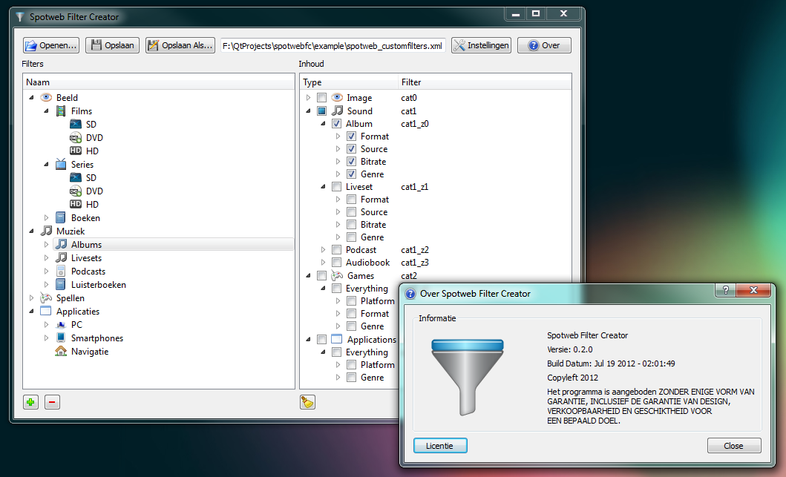

Een tijdje geleden heb ik in mijn vrije tijd een tool proberen te maken om het aanmaken van Spotweb Filter XML bestanden te vereenvoudigen.

Ik heb de wiki-pagina <a href="https://github.com/spotweb/spotweb/wiki/Hoe-filters-werken" target="_blank">hoe filters werken</a> van <a href="https://github.com/spotweb/spotweb" target="_blank">spotweb</a> hiervoor als uitgangspunt gebruikt.

Spotweb Filter Creator is gemaakt met behulp van de <a href="https://qt-project.org/downloads" target="_blank">Qt SDK</a>, hierdoor is het mogelijk multi-platform (Windows/Linux) versies van Spotweb Filter Creator te maken.

Meer informatie en download links zijn aanwezig op de [Spotweb Filter Creator](../../projects/spotweb-filter-creator) project pagina.
