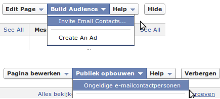

Yes, I know, translating GUI's and webpages correctly is a difficult task. There is a lot of multilingual software out in the wild that is translated very poorly... Yes, sometimes even Microsoft Windows in Dutch looks awful. 😉

But now have a look at the following example. This is not what you expect of a big multinational company called Facebook.

My native language is Dutch, and so my Facebook language was also set to Dutch. I had a look at the "Build Audience" menu at my Facebook page, this is called "Publiek opbouwen" in Dutch, so far so good. But then, when the drop-down menu opens, I get an option "Ongeldige e-mailcontactpersonen", this is in English "Invalid Email Contacts".. WTF does that do?!?!

I switched back to English language, then the option says "Invite Email Contacts...", well that makes more sense to me. Clicking the item opens up a dialog to send invites to your page by importing e-mail contacts from various e-mail services like Yahoo and Windows Live Hotmail.

It's a least a little bit strange that you have to click on "Invalid Email Contacts" in Dutch to invite people to your page!

Facebook, let me help you... 😉 The menu item should be translated to "E-mailcontactpersonen uitnodigen..." or something alike.
