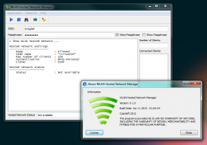

Sometimes there are places where no WiFi connection is available, only a wired internet connection. You would like to use your smart phone/tablet to connect to the internet, but your smart phone/tablet only supports WiFi.

You have your Windows 7 powered notebook/computer connected to the wired internet and would like to share the internet connection with your smart phone/tablet by using the built-in WiFi adapter (or WLAN USB Stick).

Guess what, it's possible! Windows 7 has a built-in functionality to create a Virtual WiFi Network.

Unfortunately this functionality is only available to you by firing up the command prompt and executing various commands manually.

My freely available WLAN Hosted Network Manager is a small utility to help setting up a WLAN hotspot in Windows 7 using a GUI, so you don't have to type those commands anymore :-)

With WLAN Hosted Network Manager you can create / start / stop a WLAN hostednetwork also known as Virtual WiFi Network.

The GUI executes the needed netsh commands for you.

The only thing you need to set up manually is Internet Connection Sharing on your Wired Network Adapter to the WiFi Miniport Adapter at Control Panel\\Network and Internet\\Network Connections.

For more information about the executed netsh commands and how to set up Internet Connection Sharing, have a look at: [How-to-Create-Wireless-Hosted-Networks-in-Windows-7](http://www.wi-fiplanet.com/tutorials/article.php/3849841/How-to-Create-Wireless-Hosted-Networks-in-Windows-7.htm)

More information and download links are available on the [WLAN Hosted Network Manager](http://www.brainbytez.nl/wlan-hosted-network-manager/ "WLAN Hosted Network Manager") project page.
