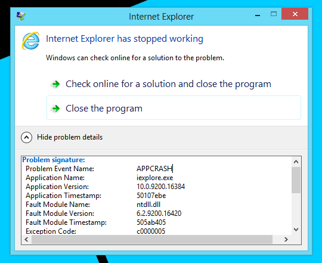

import Link from "@components/Link.astro";

Last Friday I decided to upgrade to Windows 8, not on my netbook I wrote about [here](../../blog/007-windows-8-een-show-stopper), but on my main desktop PC.

I was anxious to do an upgrade installation, I expected lots of trouble with existing already installed applications.
I really do NOT prefer "upgrade" installation types.
I prefer clean installs. But to be able to use the upgrade offer for €29,99 you have to do the nasty method of installing Windows 8 Pro on top of a qualified OS.

The upgrade took some time, finally arrived at Windows 8, I checked what applications were still working, and which stopped working properly.

Surprisingly almost all applications worked as they should, but I have found one application which does not work anymore after the upgrade.
Guess which one? You are right, Microsoft's own awful browser Internet Explorer 10 doesn't work on Windows 8 (on my PC).
It's really mind-boggling that Microsoft can't get their own stuff working properly after an upgrade.

As expected the "Check online for a solution and close the program" does nothing, it only closes the crash dialog. (Probably because it needs IE10?!?)

I already started Internet Explorer 10 without third-party browser addons. I also did reset the settings for Internet Explorer 10.
Nothing works to solve this crash.

Well, I am not using Internet Explorer anyway for daily use, I am a die-hard Google Chrome user and thus I am using Chrome on Windows 8 which works as it should.
I disabled Internet Explorer 10 on my system by un-checking the checkbox at the Add/Remove Windows Features dialog.

I still want to know what is causing this mess, and get it to work.
If anyone knows more about this crash or has a solution (besides re-installing Windows 8 of course) let me know in the comments below. 😀

**Update**

**I've fixed the issue after searching some hours on the internet, I stumbled upon this forum thread at Microsoft TechNet: <Link external href="https://social.technet.microsoft.com/Forums/en-CA/w8itproinstall/thread/2bbb1f78-9380-4bda-9154-ef36b3cae4d7">Windows 8 Pro upgrade - Internet Explorer 10 won't run</Link>**

**According to this thread, Logitech Webcam Software was the issue causing Internet Explorer to crash at startup, that did ring some bells here, I uninstalled it immediately, ét voila, Internet Explorer 10 started to work! Who is guilty? Microsoft or Logitech? I don't know, anyway it works now.**
