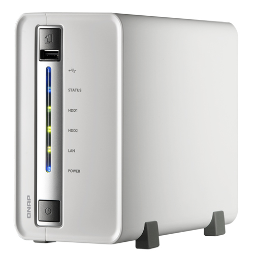
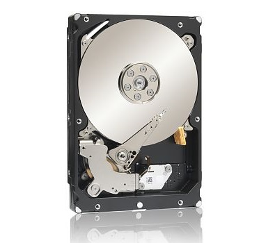

import Link from "@/components/Link.astro";

Some weeks ago I bought a NAS from QNAP, the 2-bay TS-212 version.



Along with this device I purchased a 3TB Seagate HDD, model ST3000DM001.
On the QNAP website, I read that this particular HDD needed a firmware update to work properly.
My Seagate drive was packed with firmware CC4B, which for some reason was not eligible for updating to CC4H.



I decided to stick the HDD into the QNAP NAS and see what happens.
Initially I installed firmware version 3.8.0 on the QNAP NAS, last week I did the update to version 3.8.1 which went far from flawless.

The update failed the first (live-update) and second (manual update) time, but for some reason after the third time trying to install the update manually, it succeeded.

Now, with version 3.8.1 installed, I noticed a big annoyance.

It's the terrible sound that the Seagate ST3000DM001 is making.
Almost every time the NAS is trying to access the HDD, it makes a very loud "chirp" sound.
It drove me crazy, and went to search for solutions, because it didn't sound very healthy.

Browsing through the Seagate and QNAP forums, I found a working solution.

The trick is to disable the Advanced Power Management (aka APM) feature of the Seagate HDD which will also reduce the Load\Cycle\Count.

Before continuing please read the disclaimer below. Making modifications to the QNAP NAS and/or HDD can cause hardware failures/defects if not handled properly.
I am not responsible for any damages that occur due to these modifications.
To be short, these steps are written in the hope that they will be useful, but WITHOUT ANY WARRANTY; without even the implied warranty of MERCHANTABILITY or FITNESS FOR A PARTICULAR PURPOSE.

If you are OK with the above disclaimer, then let's get started.. 😀

1. Login to the web administration panel of the QNAP NAS.
2. Click on 'Applications' -> 'QPKG Center' in the sidebar.
3. Install and activate 'Optware'.
4. Download and install PuTTY on your desktop to login with a SSH connection to the QNAP NAS. PuTTY for Windows can be downloaded here: <Link external href="https://www.chiark.greenend.org.uk/~sgtatham/putty/latest.html">PuTTY Latest Release</Link>
5. Login with your administrator account to the QNAP NAS using PuTTY/SSH.
6. Install the latest version of hdparm by executing:

```
ipkg install hdparm
```

7. The latest version of hdparm will be downloaded and installed.
8. Now you'll need to find out how your Seagate disks are mounted, you can do this by executing: mount
9. To disable APM of a drive, execute:

```
/share/HDA_DATA/.qpkg/Optware/sbin/hdparm-hdparm -B 255 /dev/sda3
```
(the parts **HDA_DATA** and **/dev/sda3** can differ in your case, in my case Optware is installed on HDA_DATA and the Seagate drive to disable APM is mounted as /dev/sda3)

10. To apply this command at boot time of the NAS, an autorun.sh file has to be created. For more information about this process, please visit: <Link external href="https://wiki.qnap.com/wiki/Running_Your_Own_Application_at_Startup">https://wiki.qnap.com/wiki/Running_Your_Own_Application_at_Startup</Link> (FYI: I did a combination of Method 1 and Method 3.)
11. The contents of the autorun.sh file should look something like this:

```
#!/bin/sh

/share/HDA_DATA/.qpkg/Optware/sbin/hdparm-hdparm -B 255 /dev/sda3
```

12. After completing these steps successfully, the annoying "chirp" sound should be gone.
13. Good luck!

Sources:
<Link external href="https://forum.qnap.com/viewtopic.php?f=182&t=59753">QNAP NAS Community Forum</Link>

<sup>Update 2026-01-03: URL to forums.seagate.com removed (invalid SSL certificate)</sup>