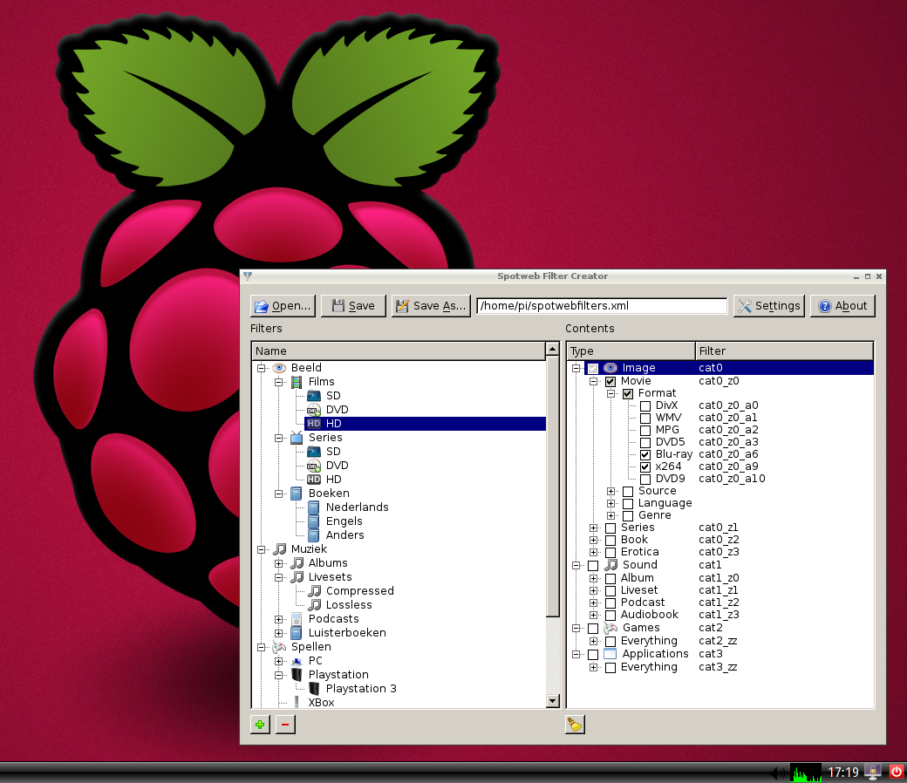

import Link from "@/components/Link.astro";

Today, I've managed to build a version of Spotweb Filter Creator for the Raspberry Pi. I've built and tested it on the recommended OS: Raspbian Wheezy.

To download and install Raspbian Wheezy, visit the downloads section of the Raspberry Pi website: <Link external href="https://www.raspberrypi.org/software">https://www.raspberrypi.org/software</Link>

For the Raspberry Pi owners who want to play around with it, head over to the [Spotweb Filter Creator](../../projects/spotweb-filter-creator) project page, and download the RPi version.

Below is a screenshot of Spotweb Filter Creator running on Raspbian Wheezy

Have fun creating those spotweb filters on this wonderful small and affordable computer. 😀
