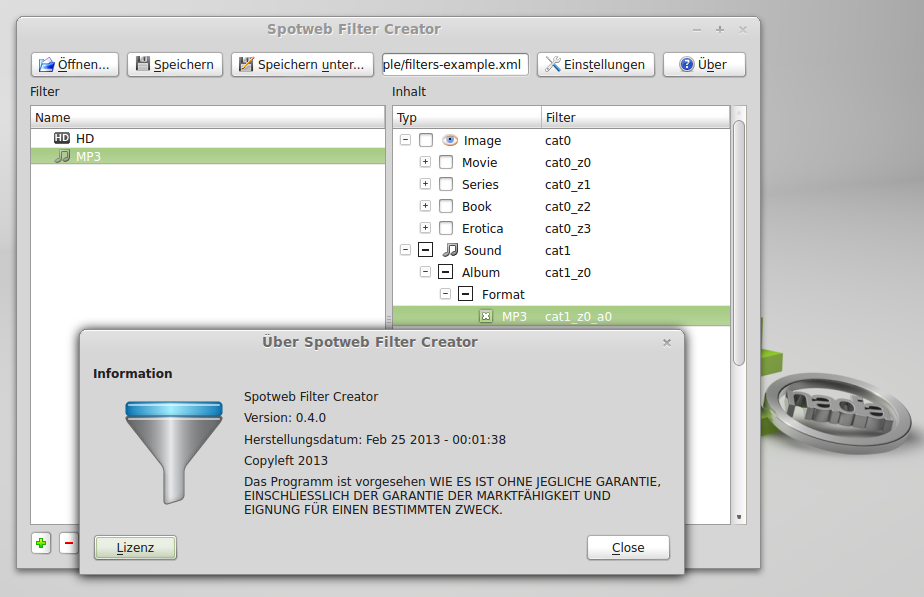

import Link from "@/components/Link.astro";

Spotweb Filter Creator 0.4.0 has been released.

Two new languages have been added to this release, German and French.
Below is a screenshot of the German version, running in Linux Mint 14 (nadia).

Also the mechanism to load the translations is now much more dynamic than it was before.
This is a little bit techy stuff, but Spotweb Filter Creator doesn't need a recompile anymore when just adding new languages.

The available languages are now defined in the <Link external href="https://github.com/BrainB0ne/spotwebfc/blob/master/spotwebfc.lng">spotwebfc.lng</Link> file instead of hardcoded into the source code.

For those that are interested, I've uploaded the translations to Transifex.

Update 2026-01-01: URL to transifex.com removed (project is offline)

The translation project is "Free For All", so feel free to contribute if you want Spotweb Filter Creator translated in your own native language. 😀

Downloads for Windows, Linux and Raspberry Pi are available at the [Spotweb Filter Creator](../../projects/spotweb-filter-creator) project page.
