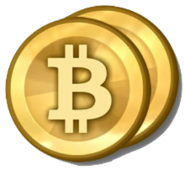

Hello there, lately I started to dig myself into the world of [Bitcoin](https://bitcoin.org/). I started reading articles/tutorials about this digital currency to find out what's it all about.

Because I am interested in new technologies and applaud innovations, I am excited to see where this all ends.

As of today, I have added a Bitcoin Donate button on my blog. If you are enjoying the software tools I have made and published, feel free to send a (small) Bitcoin donation. By clicking the Bitcoin donate button in the sidebar, you'll see a pop-up window containing the Bitcoin address, ready for you to copy/paste in your Bitcoin Wallet software.

If you also like the idea of Bitcoin and it's possibilities and want to "buy me a beer", go ahead! 😀
