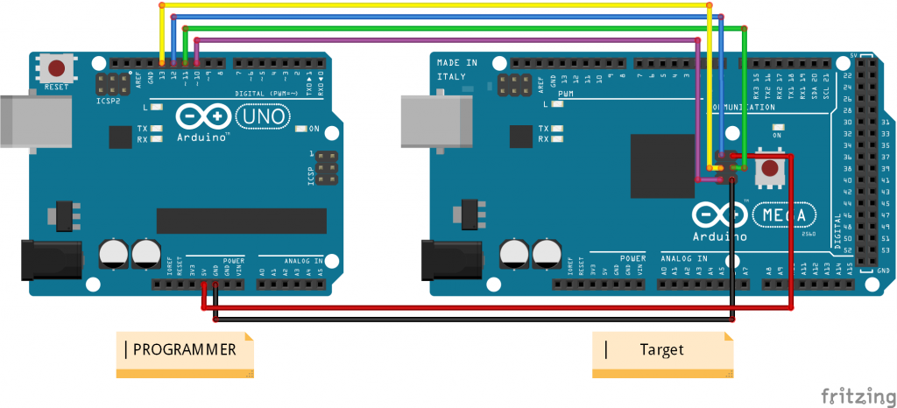
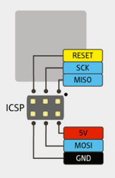
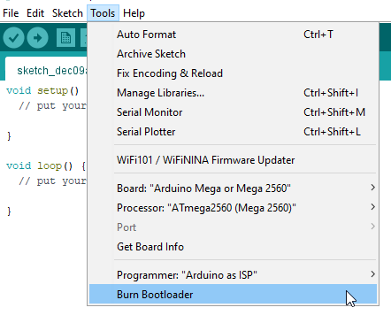
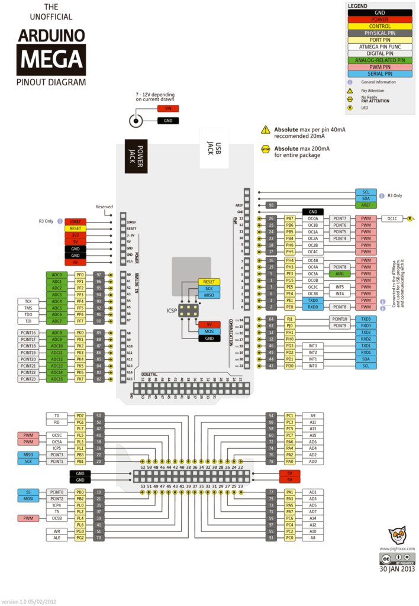

To enable the JTAG Interface on an Arduino Mega the JTAGEN fuse bit must be set to zero.

A modified Arduino bootloader with JTAGEN fuse bit enabled can be programmed by using an Arduino Uno as ISP (In-circuit Serial Programmer).

The [Arduino IDE](https://www.arduino.cc/en/software) can be used to burn the bootloader after making the following modifications to <Arduino IDE Path>\\hardware\\arduino\\avr\\boards.txt

`"C:\Program Files (x86)\Arduino\hardware\arduino\avr\boards.txt"`

The following calculator can be useful to calculate the correct value: [Fusecalc](https://www.engbedded.com/fusecalc)

The **mega.menu.cpu.atmega2560.bootloader.high\_fuses** value is modified from 0xD8 to **0x98**

```
## Arduino Mega w/ ATmega2560
## -------------------------
mega.menu.cpu.atmega2560=ATmega2560 (Mega 2560)

mega.menu.cpu.atmega2560.upload.protocol=wiring
mega.menu.cpu.atmega2560.upload.maximum_size=253952
mega.menu.cpu.atmega2560.upload.speed=115200

# mega.menu.cpu.atmega2560.bootloader.high_fuses=0xD8
mega.menu.cpu.atmega2560.bootloader.high_fuses=0x98
```

Connect the Arduino ISP (Arduino Uno) to the target (Arduino Mega). Connect the Arduino ISP (Arduino Uno) to the PC with an USB cable.

\[caption id="attachment\_968" align="aligncenter" width="480"\][](https://www.brainbytez.nl/wp-content/uploads/2021/12/ArduinoISP_bb.png) Arduino Uno as ISP <-> Arduino Mega 2560\[/caption\]

<!--more-->

\[table id=1 /\]

\[caption id="attachment\_1000" align="aligncenter" width="194"\] Arduino Mega ICSP Header\[/caption\]

More information about creating an Arduino ISP (In-circuit Serial Programmer): [Tutorial ArduinoISP](https://www.arduino.cc/en/Tutorial/BuiltInExamples/ArduinoISP)

When board, processor and port is setup correctly and the programmer is connected to the target the Bootloader can be burned from the Arduino IDE.

\[caption id="attachment\_971" align="alignnone" width="442"\] Arduino IDE\[/caption\]

After burning the bootloader the JTAGEN fuse should be enabled.

Additionally, clear the JTD bit in the MCUCR register. This can be done by creating a new Arduino Mega (ATmega2560) project with [Visual Studio Code](https://code.visualstudio.com) using the [PlatformIO IDE](https://platformio.org) extension.

The following code will clear the JTD bit without changing the other bits in the MCUCR register:

```
void setup() {
// put your setup code here, to run once:
MCUCR = MCUCR & ~(1<<JTD);
}

void loop() {
// put your main code here, to run repeatedly:
}

```

Pins A4-A7 are now configured as JTAG signals: TCK, TMS, TDO, TDI.

\[caption id="attachment\_1052" align="aligncenter" width="480"\][](https://www.brainbytez.nl/wp-content/uploads/2021/12/ArduinoMega.png) Arduino Mega Pinout Diagram\[/caption\]

 

**Please read the following disclaimer before making changes to your device / software:**

```
Disclaimer

* I'm not responsible for bricked devices, dead SD cards, thermonuclear war, or you getting fired because the alarm app failed.
* YOU are choosing to make these modifications, and if you point the finger at me for messing up your device, I will laugh at you.
* Your warranty will be void if you tamper with any part of your device / software.
```
