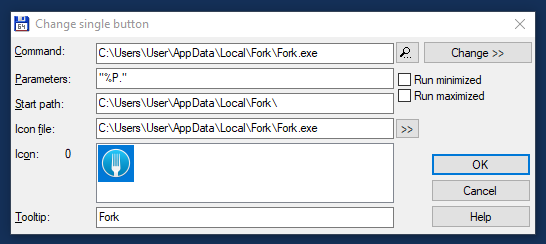

import Link from "@/components/Link.astro";
import Callout from "@/components/Callout.astro";

I discovered that it is easy to open the current selected Git repository with <Link external href="https://fork.dev">Fork</Link> through <Link external href="https://www.ghisler.com">Total Commander</Link>.

1. Add a new Toolbar Button to the Total Commander Toolbar.
2. Select the Fork Executable: C:\Users\User\AppData\Local\Fork\Fork.exe
3. Parameters: "%P."
4. Start path: C:\Users\User\AppData\Local\Fork\
5. Select Icon
6. Tooltip: Fork

<Callout type="warning">Replace "User" with your own Windows Username!</Callout>

Save this Button and it will be shown in the Toolbar. Clicking the Button results in Fork being launched with the selected repository.

