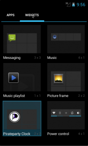
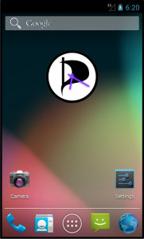

In tijden waar internet providers (UPC, KPN, Tele2, T-Mobile, Telfort, XS4ALL) door lobbyclubs [gedwongen](http://tweakers.net/nieuws/81883/ook-andere-providers-moeten-the-pirate-bay-blokkeren.html) worden bepaalde delen van het internet te blokkeren...

In tijden waar de patenten-strijd of beter gezegd waanzin innovatie onmogelijk maakt...

In tijden waar de regering de thuiskopieheffing gaat [uitbreiden](http://tweakers.net/nieuws/85160/thuiskopieheffing-wordt-5-euro-voor-pcs-en-laptops-in-2013.html)...

In tijden waar de stichting die hiervoor in het leven is geroepen [de hals nòg niet vol krijgt](http://tweakers.net/nieuws/85185/buma-stemra-en-thuiskopie-vinden-nieuwe-thuiskopieheffingen-te-laag.html), en de heffing te laag vindt...

In tijden waar de Piratenpartij voor het gerecht moet komen vanwege het [linken](http://tweakers.net/nieuws/81894/piratenpartij-mag-niet-verwijzen-naar-pirate-bay-proxys.html) naar manieren om de "The Pirate Bay" blokkade te omzeilen...

In die tijden is het de hoogste tijd om eens na te gaan denken over hoe laat het nu ècht is. Vandaar deze Android App/Widget, een Piratenpartij Klok.

Meer informatie en downloads op de [project pagina](http://www.brainbytez.nl/piratenpartij-klok-widget/ "Piratenpartij Klok Widget")

