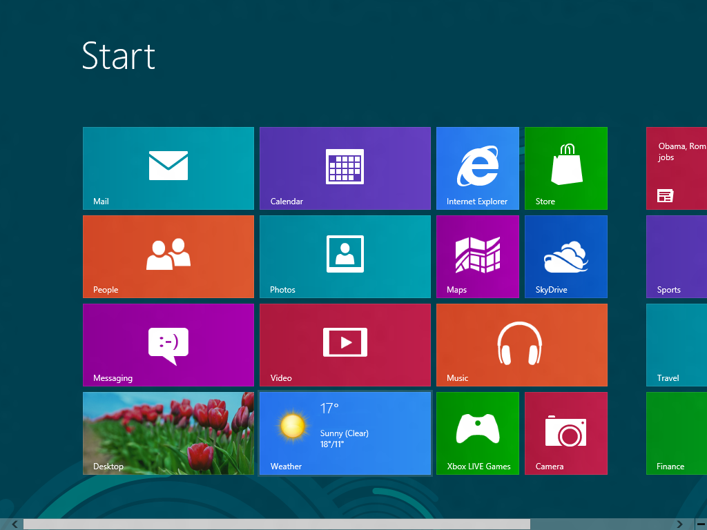
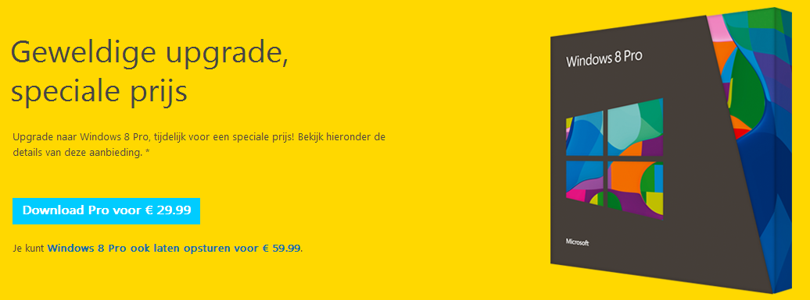
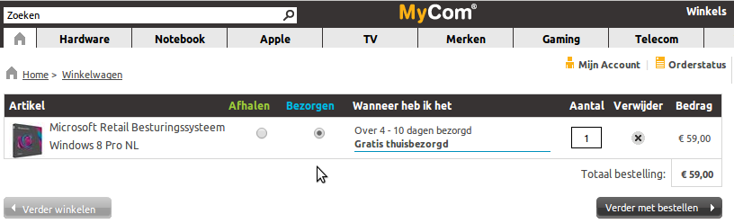

---

Microsoft Windows 8 is sinds gisteren officieel [verkrijgbaar](http://tweakers.net/nieuws/85170/microsoft-brengt-windows-8-en-windows-rt-uit.html). Hoera, of toch niet?

## Inleiding

Er is in de afgelopen tijd enorm veel geschreven over dit "vernieuwende" besturingssysteem. Windows 8 gooit haar zelf opgebouwde historie de prullenbak in, weg met de startknop, weg met kleine icoontjes op het bureaublad. Vierkante en rechthoekige bont gekleurde tegels zijn ervoor in de plaats gekomen. "Microsoft Tiles", of "Microsoft Bricks" als naam was hier beter op z'n plaats geweest, maar dit terzijde. Applicaties draaien of in tegelvorm, of in fullscreen mode als erop wordt geklikt. Het ouderwetse vergroten/verkleinen/verplaatsen/sluiten van applicaties is er niet meer bij. (Tenzij een oude applicatie gemaakt voor Windows XP/Vista/7 wordt opgestart, hierover later meer.)

## Developer / Consumer Preview

Enige tijd geleden heb ik zelf de Windows 8 Developer en Consumer Preview al eens geinstalleerd in een VirtualBox omgeving, gewoon om eens te kijken wat het was of is. Uit nieuwsgierigheid. Ik had al vrij snel in de gaten dat dit besturingssysteem niet ontworpen is voor de traditionele desktop computer met grote beeldschermen bestuurd met een toetsenbord en muis. Dit besturingssysteem is gemaakt voor tablets, in ieder geval apparaten met een touch screen. De "experience" veranderde al snel in een grote frustratie. Er moeten kilometers worden gemaakt met de muis om van de ene naar de andere applicatie over te schakelen. Kortom, een RSI opwekkend systeem. Traditionele applicaties gemaakt voor Windows XP/Vista/7 werken ook in Windows 8 (behalve in de Windows 8 RT versie, de tablet versie). Hiervoor wordt er automatisch overschakeld naar de traditionele desktop interface. Echter om een andere (traditionele) applicatie op te starten moet men weer terug naar de Windows 8 interface, om vervolgens weer terug te keren naar de traditionele desktop interface. Een "experience" waar je al snel zeeziek van wordt. Ik had inmiddels besloten dat dit besturingssysteem niet op mijn desktop PC komt (update 4-11-12: toch heb ik afgelopen vrijdag een upgrade gewaagd op de desktop, met het volgende resultaat: [link](http://www.brainbytez.nl/windows/internet-explorer-10-has-stopped-working-in-windows-8/ "Internet Explorer 10 has stopped working in Windows 8")). Ik weet nog dat ik destijds uit frustratie riep: "Dit is een drie tientjes OS!"...

## Drie Tientjes

Gisteren was het dan zover, de release van Windows 8. En wat schetste mijn verbazing? Windows 8 kan aangeschaft worden voor 3 tientjes! Ik heb nog een netbook (Asus eeePC 1000H) draaiende op Windows XP in bezit. Ik bedacht dat dit misschien wel eens de ideale kanshebber zou zijn om Windows 8 op installeren, vanwege het kleine 10 inch scherm. Echter werkt de aanschaf niet zoals ik in gedachte had. De drie tientjes versie betreft namelijk een upgrade.

Hiervoor moet een geldige (genuine) Windows XP/Vista/7 geinstalleerd zijn. Windows 8 wordt dan over het huidige besturingssysteem heen geinstalleerd. Een methode waarbij mij al snel de haren overeind gaan staan. Dit is duidelijk een "Jan met de pet"-oplossing of een "Henk & Ingrid"-methode, noem het zoals je wilt. Deze oplossing is verre van ideaal en erg omslachtig. Ik ben van de afdeling "clean installs" oftwel schone installaties. Een DVD branden, opstarten vanaf DVD, de C:\\ partitie formatteren en vervolgens het besturingssysteem installeren. Upgrade methodes waarbij gerommeld wordt met aanwezige bestanden en applicaties resulteren vaak in een gaar soepje met alle gevolgen en problemen van dien. Ik zie een soort van [DLL Hell](http://en.wikipedia.org/wiki/DLL_Hell) voor me, waarbij men oeverloos moet gaan zoeken naar oplossingen voor niet meer werkende, crashende of incorrect functionerende applicaties. Bovendien, als men in de toekomst Windows 8 weer opnieuw wil installeren, moet er eerst weer Windows XP/Vista/7 worden geinstalleerd alvorens men Windows 8 kan installeren. Erg omslachtig, en ongeschikt voor de gemiddelde tweaker. Natuurlijk kan men ook kiezen voor een fysieke retail versie in DVD vorm bij verschillende webshops, maar deze hebben al snel een prijskaartje van 125+ euro's. Zover gaat mijn nieuwsgierigheid naar een nieuw Windows besturingssysteem voor privé-gebruik nu ook weer niet..

Overigens probeert [MyCom](http://www.mycom.nl/Product/Software-en-Boeken-Retail-Besturingssysteem/Microsoft-Windows-8-Pro-NL/1366096) een "Upgrade" versie te slijten aan klanten verpakt als "Retail" pakket. Erg verwarrend voor de niet-oplettende consument!

## De Show-Stopper

Ik heb toch maar eens de door Microsoft aangeboden "Windows 8-upgradeassistent" geinstalleerd en uitgevoerd op mijn netbook. De assistent doorzoekt de complete netbook op allerlei applicaties/apparaten die geinstalleerd zijn en geeft na afloop een compatibileitsrapport.

Wat blijkt nu? Mijn netbook is ongeschikt om applicaties vanuit de Windows Store te installeren. Dit omdat mijn netbook niet voldoet aan de minimale resolutie. Oudere netbooks draaien doorgaans een resolutie van 1024x600, en de minimale resolutie om toegang te krijgen tot de Windows Store is 1024x768. Hoe gek kun je het verzinnen. Dit besturingssysteem zou aardig kunnen werken op apparaten met kleinere schermen en lagere resoluties. Microsoft denkt er blijkbaar anders over. Deze apparaten krijgen geen entree tot de Windows Store. Kortom, Microsoft zet de oudere netbooks bij het grofvuil. Verder ontdekte ik de applicatie Skype in het overzicht, pronkend met een uitroepteken inclusief de melding: "Betaalde upgrade beschikbaar". Krijg nou wat? Een applicatie die altijd gratis is geweest wordt nu ineens een betaalde app? Maar het opmerkelijkste is nog dat ik deze betaalde app niet eens zou kunnen kopen, omdat ik geen toegang zou krijgen tot de Windows Store! Werkt de oude versie van Skype dan wel nog? Of blokkeert Microsoft dit? Wie zal het zeggen? Het mag namelijk geen geheim zijn dat Microsoft de scepter zwaait bij Skype. Dit alles is voor mij een Show-Stopper. "Wat heeft Windows 8 dan nog voor toegevoegde waarde?" vraag ik mij af.

Microsoft zou Microsoft natuurlijk niet zijn, als ze toch niet een poging wagen om je langs de kassa te krijgen, natuurlijk gewapend met je creditcard in je hand. De assistent loodst je dan ook dus zonder enige belemmering door naar de kassa.

Hier stopt de Windows 8 tour voor mij. Nee, zelfs de drie tientjes gaan niet naar Redmond!

