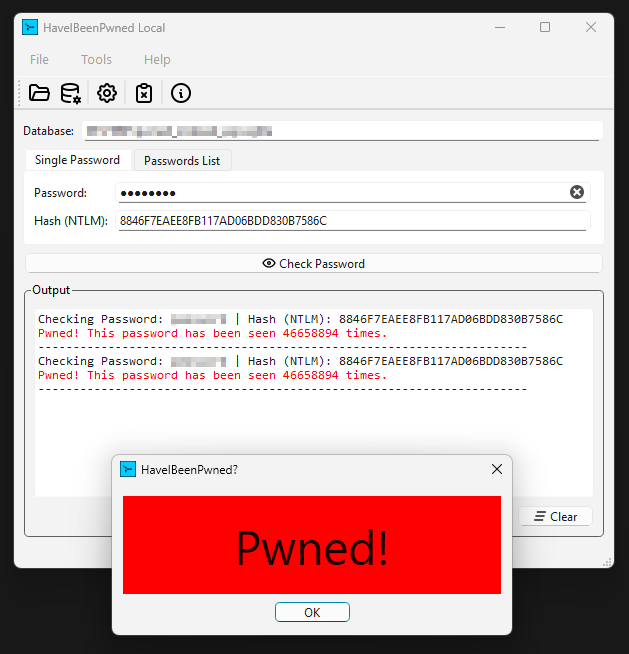
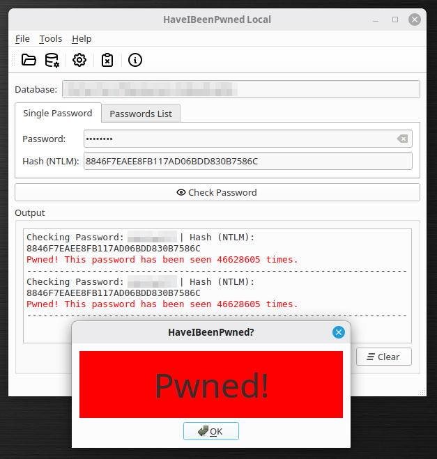

import Link from "@components/Link.astro";
import LinkButton from "@components/LinkButton.astro";
import DownloadLinkButton from "@components/DownloadLinkButton.astro";
import Callout from "@components/Callout.astro";

## 👋 Introduction
HaveIBeenPwned-Local is a Qt GUI application to check passwords against a locally stored HaveIBeenPwned SQLite Database.
This project is developed with Qt 6.9.3.

This application can also convert a NTLM-hash text file to a SQLite database by running: hibp2sqlite.

More information: <Link external href="https://github.com/BrainB0ne/hibp2sqlite">GitHub: hibp2sqlite</Link>
or <Link external href="https://codeberg.org/BrainB0ne/hibp2sqlite">Codeberg: hibp2sqlite</Link>

To obtain the NTLM-hash text file, use <Link external href="https://github.com/HaveIBeenPwned/PwnedPasswordsDownloader">PwnedPasswordsDownloader</Link> from HaveIBeenPwned.

Install PwnedPasswordsDownloader by following the instructions described on the link above.

Then, download all NTLM hashes to a single txt file called pwnedpasswords_ntlm.txt

```batch
haveibeenpwned-downloader.exe -n pwnedpasswords_ntlm
```

_Menu -> Database -> Convert_ starts a "Text to SQLite" conversion process with hibp2sqlite.

<Callout type="warning">
**Make sure there is enough free space on your drive since this file is at the time of writing ~70 GB.**
**The conversion to SQLite with hibp2sqlite takes another ~180 GB for the SQLite database file.**
</Callout>

<Callout type="info">
Credits to the <Link external href="https://medium.com/@chris-inmodis">author</Link> of
<Link external href="https://medium.com/analytics-vidhya/creating-a-local-version-of-the-haveibeenpwned-password-database-with-python-and-sqlite-918a7b6a238a">this article</Link>
since it gave me the idea to create this tool.
</Callout>

## ❗ Build Requirements
- Windows
  - Microsoft Visual Studio 2022
  - Qt SDK 6.9.3 / Qt Creator 18

## 🖼️ Screenshots




## ⚠️ Disclaimer
<Callout type="warning">
I'm not responsible for bricked devices, dead SD cards, thermonuclear war, or you getting fired because the alarm app failed.
YOU are choosing to make these modifications, and if you point the finger at me for messing up your device, I will laugh at you.
</Callout>

## 📥 Downloads

### Windows
<div class="flex flex-wrap gap-y-2">
    <DownloadLinkButton icon="download" href="https://codeberg.org/BrainB0ne/haveibeenpwned-local/releases/download/v0.2.0/haveibeenpwned-local-0.2.0-x64-setup.exe">Have I Been Pwned Local v0.2.0 (x64-windows-installer)</DownloadLinkButton>
    <DownloadLinkButton icon="download" href="https://codeberg.org/BrainB0ne/haveibeenpwned-local/releases/download/v0.2.0/haveibeenpwned-local-0.2.0-x64.zip">Have I Been Pwned Local v0.2.0 (x64-windows-zip)</DownloadLinkButton>
</div>

### Linux
<div class="flex flex-wrap gap-y-2">
    <DownloadLinkButton icon="download" href="https://codeberg.org/BrainB0ne/haveibeenpwned-local/releases/download/v0.2.0/HaveIBeenPwned-Local-0.2.0-x86_64.AppImage">Have I Been Pwned Local v0.2.0 (x86_64-AppImage)</DownloadLinkButton>
</div>

## 💻 Source
<div class="flex gap-2">
    <LinkButton external icon="github" href="https://github.com/BrainB0ne/haveibeenpwned-local">Available on GitHub</LinkButton>
    <LinkButton external icon="codeberg" href="https://codeberg.org/BrainB0ne/haveibeenpwned-local">Get it on Codeberg</LinkButton>
</div>

## 🏛️ License

```
HaveIBeenPwned-Local
Copyleft 2025

This program is free software: you can redistribute it and/or modify
it under the terms of the GNU General Public License as published by
the Free Software Foundation, either version 3 of the License.

This program is distributed in the hope that it will be useful,
but WITHOUT ANY WARRANTY; without even the implied warranty of
MERCHANTABILITY or FITNESS FOR A PARTICULAR PURPOSE.  See the
GNU General Public License for more details.

You should have received a copy of the GNU General Public License
along with this program.  If not, see <https://www.gnu.org/licenses/>.
```
