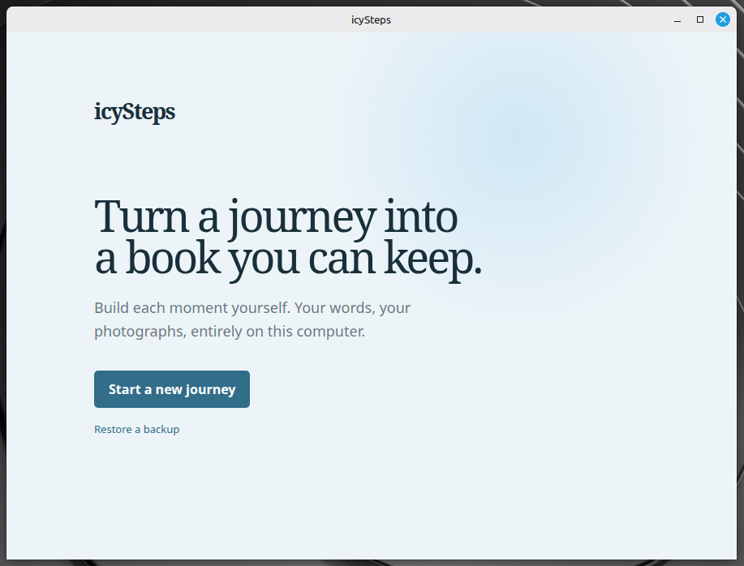

import LinkButton from "@/components/LinkButton.astro";
import DownloadLinkButton from "@/components/DownloadLinkButton.astro";
import Link from "@/components/Link.astro";

## 👋 Introduction
icySteps is a **local-first desktop application** for turning a recorded journey into a travel book you can keep, print, share, or archive.

**icySteps is vibe-coded with OpenCode: GPT 5.6 - Terra 🤖**

Create a journey, add chapters for its moments, write the story, attach photographs, and choose a cover photo and pastel theme.
The live preview shows the book as you edit it, while the export tools create the finished version locally.

icySteps does not connect to travel services, maps, analytics, CDNs, or AI APIs.
Your database and managed copies of photos stay on your computer.

The application is built with **Electron 44** and packaged with **electron-builder**.

## ❗ Build Requirements
- **Node.js 22.12 or newer**
- **npm** is used for dependency management.
- **Windows builds** produce an NSIS installer.
- **Linux builds** produce AppImage and Debian packages on Linux.

```bash
npm install
npm run dev
```

Build packages with:

```bash
npm run package
npm run package:linux
```

## ✨ Features
- **Multiple travel books** - Keep separate journeys, each with its own title, subtitle, dates, cover photo, and theme.
- **Chapter editor** - Add a date, location, story, photographs, and optional captions for every moment.
- **Drag-and-drop ordering** - Reorder chapters in the sidebar and photographs within a chapter.
- **Pastel themes** - Choose Azure, Lavender, Blush, or Apricot; the selected theme is applied to the editor, live preview, and every export format.
- **Live book preview** - See the cover and selected chapter as you work, including the chapter number, date, location, story, and photos.
- **PDF export** - Produce a print-ready A4 travel book locally.
- **Portable HTML export** - Create a standalone HTML book with a neighboring image directory and local full-screen photo viewer.
- **ZIP export** - Package the portable HTML book and its images together in one archive.
- **Optimized exports** - Auto-orient photos, limit the longest edge to 2000 pixels, and encode WebP images to keep PDF, HTML, and ZIP exports smaller.
- **Export progress** - Follow image optimization and file creation, then receive success, cancellation, or error feedback.
- **Portable backups** - Create timestamped `.icysteps-backup` archives containing the SQLite database and managed photos; restore them on another computer or after data loss.
- **Cross-platform restore** - Restored managed photo paths are repaired for the current platform, supporting Windows and Linux moves.

## 🖼️ Screenshot


## 📥 Downloads

### Windows
<div class="flex flex-wrap gap-2">
  <DownloadLinkButton
    icon="download"
    loading="lazy"
    href="https://github.com/BrainB0ne/icySteps/releases/download/v0.1.1/icySteps.Setup.0.1.1.exe">{"icySteps v0.1.1 (installer)"}</DownloadLinkButton>
</div>

### Linux
<div class="flex flex-wrap gap-2">
  <DownloadLinkButton
    icon="download"
    loading="lazy"
    href="https://github.com/BrainB0ne/icySteps/releases/download/v0.1.1/icysteps_0.1.1_amd64.deb">{"icySteps v0.1.1 (amd64-deb)"}</DownloadLinkButton>
  <DownloadLinkButton
    icon="download"
    loading="lazy"
    href="https://github.com/BrainB0ne/icySteps/releases/download/v0.1.1/icySteps-0.1.1.AppImage">{"icySteps v0.1.1 (AppImage)"}</DownloadLinkButton>
</div>

## 💻 Source
<div class="flex gap-2">
  <LinkButton
    external
    icon="github"
    loading="lazy"
    href="https://github.com/BrainB0ne/icySteps">{"Available on GitHub"}</LinkButton>
</div>

## 🏛️ License
```
icySteps
Copyright (C) 2026 BrainByteZ

This program is free software: you can redistribute it and/or modify
it under the terms of the GNU General Public License as published by
the Free Software Foundation, either version 3 of the License.

This program is distributed in the hope that it will be useful,
but WITHOUT ANY WARRANTY; without even the implied warranty of
MERCHANTABILITY or FITNESS FOR A PARTICULAR PURPOSE.  See the
GNU General Public License for more details.

You should have received a copy of the GNU General Public License
along with this program.  If not, see https://www.gnu.org/licenses/.
```
