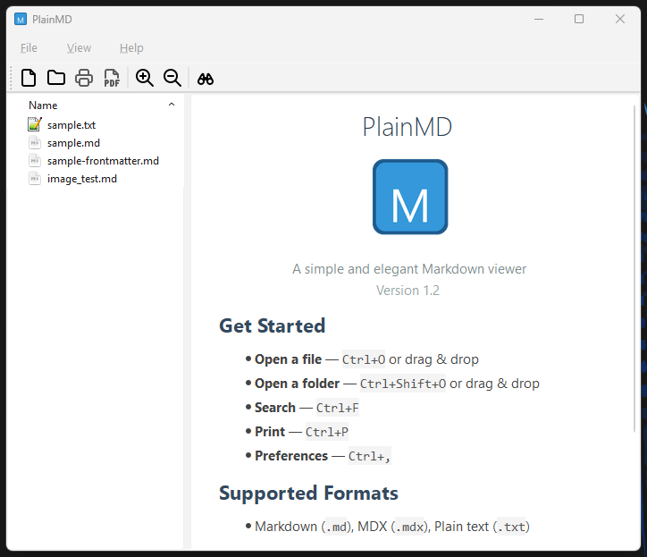

import LinkButton from "@components/LinkButton.astro";
import DownloadLinkButton from "@components/DownloadLinkButton.astro";
import Callout from "@components/Callout.astro";

## 👋 Introduction
PlainMD is a simple and elegant **Markdown Viewer** built with **Qt6**.

**PlainMD is partially vibe-coded with OpenCode: Kimi K2.5 Turbo / Kimi K2.6 🤖**

It provides fast, native rendering of Markdown files without external dependencies.
The application features a file browser sidebar for easy navigation, supports multiple formats (Markdown, MDX, and plain text),
and includes convenient features like drag-and-drop support, recent files/folders tracking, auto-reload on file changes, and export to PDF.

This project is developed with Qt 6.x (Qt 6.9.3 at the time of writing).

<Callout type="info">
The deb/AppImage files are linked with Qt 6.4.2 (System-Qt) on Linux Mint 22.3.
</Callout>

## ❗ Build Requirements
- Windows
  - Microsoft Visual Studio 2022
  - Qt SDK 6.9.3 / Qt Creator 19

## 🖼️ Screenshot


## ✨ Features
- **Native Qt6 markdown rendering** - Fast, native rendering without external dependencies
- **File browser sidebar** - Browse and open markdown files with a tree view
- **Multiple format support** - Markdown (.md), MDX (.mdx), and plain text (.txt)
- **Drag and drop support** - Open files and folders by dragging them into the window
- **Recent files & folders** - Quick access with separate history and privacy toggles
- **Auto-reload on file change** - Detects external file modifications and prompts to reload
- **Zoom controls** - Zoom in/out with Ctrl++ and Ctrl+-
- **Find/Search** - Search within documents with Ctrl+F
- **Print & Export** - Print to physical printer or export directly to PDF
- **External editor integration** - Open files with your preferred editor
- **Privacy options** - Toggle external image loading and recent history independently
- **URL tooltips** - Hover over links to see resolved absolute paths
- **YAML frontmatter display** - Shows frontmatter as a code block

## 📥 Downloads

### Windows
<div class="flex flex-wrap gap-2">
  <DownloadLinkButton
    icon="download"
    loading="lazy"
    href="https://codeberg.org/BrainB0ne/plainmd/releases/download/v1.2.0/plainmd-1.2.0-x64-setup.exe"
  >PlainMD v1.2.0 (win64-installer)</DownloadLinkButton>
  <DownloadLinkButton
    icon="download"
    loading="lazy"
    href="https://codeberg.org/BrainB0ne/plainmd/releases/download/v1.2.0/plainmd-1.2.0-x64.zip"
  >PlainMD v1.2.0 (win64-zip)</DownloadLinkButton>
</div>

### Linux
<div class="flex flex-wrap gap-2">
  <DownloadLinkButton
    icon="download"
    loading="lazy"
    href="https://codeberg.org/BrainB0ne/plainmd/releases/download/v1.2.0/plainmd_1.2.0_amd64.deb"
  >PlainMD v1.2.0 (amd64-deb)</DownloadLinkButton>
  <DownloadLinkButton
    icon="download"
    loading="lazy"
    href="https://codeberg.org/BrainB0ne/plainmd/releases/download/v1.2.0/plainmd-1.2.0-x86_64.AppImage"
  >PlainMD v1.2.0 (x86_64-AppImage)</DownloadLinkButton>
</div>

## 💻 Source
<div class="flex gap-2">
  <LinkButton
    external
    icon="github"
    loading="lazy"
    href="https://github.com/BrainB0ne/plainmd"
  >Available on GitHub</LinkButton>
  <LinkButton
    external
    icon="codeberg"
    loading="lazy"
    href="https://codeberg.org/BrainB0ne/plainmd"
  >Get it on Codeberg</LinkButton>
</div>

## 🏛️ License
```
PlainMD
Copyright (C) 2026 BrainByteZ

This program is free software: you can redistribute it and/or modify
it under the terms of the GNU General Public License as published by
the Free Software Foundation, either version 3 of the License.

This program is distributed in the hope that it will be useful,
but WITHOUT ANY WARRANTY; without even the implied warranty of
MERCHANTABILITY or FITNESS FOR A PARTICULAR PURPOSE.  See the
GNU General Public License for more details.

You should have received a copy of the GNU General Public License
along with this program.  If not, see <https://www.gnu.org/licenses/>.
```
