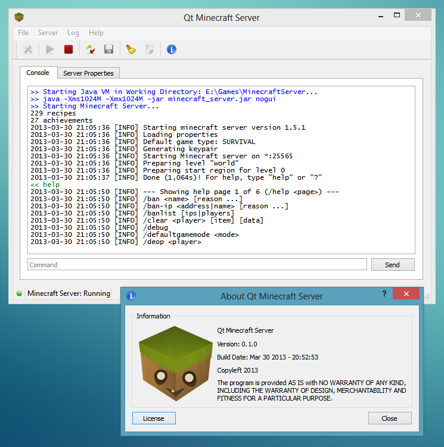

import DownloadButton from "@/components/DownloadButton.astro";

---

## 👋 Introduction

Qt Minecraft Server is a GUI application for running/managing your own Minecraft Server.

This project is developed with Qt 4.8.4

The official Minecraft Server (.jar) package can be downloaded from within the application at the Settings dialog.

## ⚠️ System Requirements

- Windows or Linux.
- A recent version of Java VM that is supported for running the Minecraft Server.
- A decent amount of RAM to run the Minecraft Server smoothly 😀

## ⭐ Recommended

- The game: [Minecraft](https://minecraft.net/) 😉



## 📥 Downloads

### Windows
<DownloadButton href="https://www.brainbytez.nl/download/825/">Qt Minecraft Server v0.1.0 (windows-installer)</DownloadButton>
<DownloadButton href="https://www.brainbytez.nl/download/827/">Qt Minecraft Server v0.1.0 (windows-zip)</DownloadButton>

### Linux
<DownloadButton href="https://www.brainbytez.nl/download/831/">Qt Minecraft Server v0.1.0 (32bit-linux-tar.gz)</DownloadButton>
<DownloadButton href="https://www.brainbytez.nl/download/829/">Qt Minecraft Server v0.1.0 (64bit-linux-tar.gz)</DownloadButton>

## 💻 Source

[](https://github.com/BrainB0ne/qtmcserver)

[](https://codeberg.org/BrainB0ne/qtmcserver)

## 🏛️ License

```
Qt Minecraft Server
Copyleft 2013

This program is free software: you can redistribute it and/or modify
it under the terms of the GNU General Public License as published by
the Free Software Foundation, either version 3 of the License.

This program is distributed in the hope that it will be useful,
but WITHOUT ANY WARRANTY; without even the implied warranty of
MERCHANTABILITY or FITNESS FOR A PARTICULAR PURPOSE.  See the
GNU General Public License for more details.

You should have received a copy of the GNU General Public License
along with this program.  If not, see <https://www.gnu.org/licenses/>.
```
