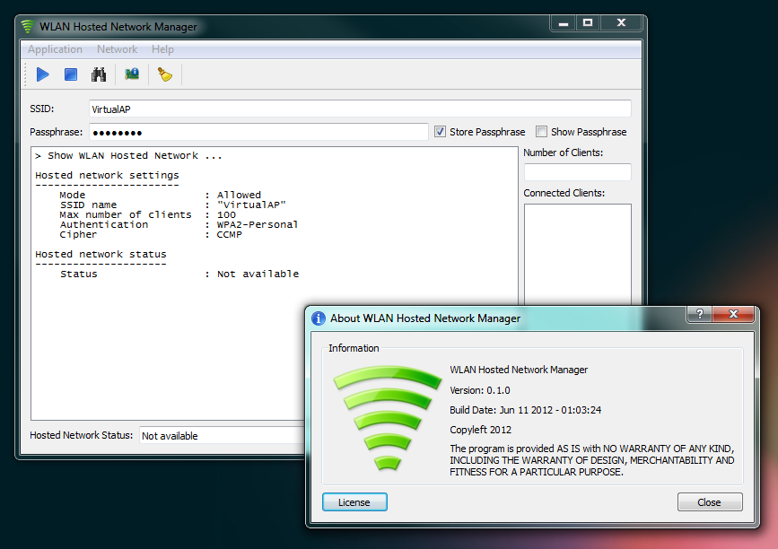

import DownloadButton from "@/components/DownloadButton.astro";

---

## 👋 Introduction

WLAN Hosted Network Manager is a GUI application for managing (creating/starting/stopping) a WLAN hostednetwork also known as Virtual WiFi Network.

This project is developed with Qt 5.11.3

This application executes netsh commands available in Windows 7/8/10 to create a Virtual Wireless Network.

## ⚠️ System Requirements

\- Windows 7/8/10 - Wireless Network Adapter with hostednetwork support.



## 📥 Downloads

### Windows
<DownloadButton href="https://www.brainbytez.nl/download/813/">WLAN Hosted Network Manager v0.3.0 (windows-installer)</DownloadButton>
<DownloadButton href="https://www.brainbytez.nl/download/815/">WLAN Hosted Network Manager v0.3.0 (windows-zip)</DownloadButton>

## 💻 Source

[](https://github.com/BrainB0ne/hostednetwork-gui)

[](https://codeberg.org/BrainB0ne/hostednetwork-gui)

## 🏛️ License

```
WLAN Hosted Network Manager
Copyleft 2019

This program is free software: you can redistribute it and/or modify
it under the terms of the GNU General Public License as published by
the Free Software Foundation, either version 3 of the License.

This program is distributed in the hope that it will be useful,
but WITHOUT ANY WARRANTY; without even the implied warranty of
MERCHANTABILITY or FITNESS FOR A PARTICULAR PURPOSE.  See the
GNU General Public License for more details.

You should have received a copy of the GNU General Public License
along with this program.  If not, see <https://www.gnu.org/licenses/>.
```
